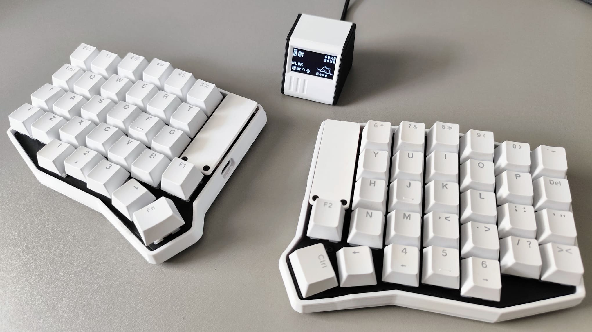

# Tergo Teclados

Teclado ergonômico customizado de verdade no Brasil!

Conheça em https://tecladoergonomico.com.br

## Firmwares Tergo Sofle

Para a versão Padrão (com fio), você encontra o firmware [clicando aqui](https://github.com/TergoTeclados/vial-qmk-firmware/releases).

Já para a versão Wireless (sem fio), [clique aqui](https://github.com/TergoTeclados/zmk-config-tergo-sofle/releases).

## Documentação

Na [documentação](https://github.com/TergoTeclados/Tergo-Sofle-Documentation) você conhecerá cada detalhe do teclado Tergo Sofle.
